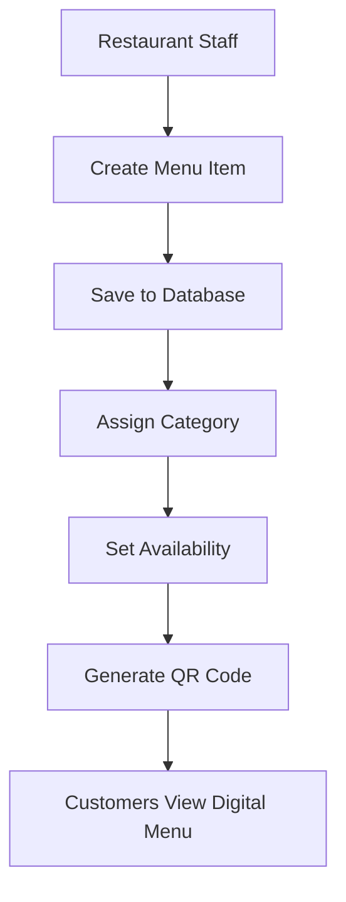

# 🍽️ Restaurant Menu Management System


A Django web application for managing a restaurant's digital menu. Restaurant staff can create and organize menu items by category, assign prices, manage availability, and generate QR codes that customers can scan to access the menu.

---

# 📌 Features

- Add new menu items
- Edit existing dishes
- Organize dishes by category
- Display dish descriptions and prices
- Mark menu items as available or unavailable
- Associate menu items with authenticated users
- Automatic timestamps for creation and updates
- QR code support for digital menus
- Built with Django ORM and SQLite

---

# 🛠️ Technologies Used

| Technology | Purpose |
|------------|---------|
| Python | Backend programming |
| Django | Web framework |
| SQLite | Database |
| Django ORM | Database management |
| Pillow | Image processing |
| QRCode | QR code generation |

---

# 📂 Project Structure

```text
restaurant-menu/
│
├── manage.py
├── mysite/
│   ├── settings.py
│   ├── urls.py
│   └── ...
│
├── restaurant_menu/
│   ├── models.py
│   ├── views.py
│   ├── admin.py
│   ├── urls.py
│   ├── templates/
│   ├── static/
│   └── migrations/
│
└── db.sqlite3
```

---

# 🗄️ Database Model

The application stores restaurant menu items using the following model:

```python
class Item(models.Model):
    dish = models.CharField(max_length=1000, unique=True)
    description = models.CharField(max_length=2000)
    price = models.DecimalField(decimal_places=2, max_digits=10)
    category = models.CharField(max_length=200, choices=DISH_TYPE)
    author = models.ForeignKey(User, on_delete=models.PROTECT)
    status = models.IntegerField(choices=STATUS, default=0)
    date_created = models.DateTimeField(auto_now_add=True)
    date_modified = models.DateTimeField(auto_now=True)
```

### Model Fields

| Field | Description |
|---------|------------|
| Dish | Name of the menu item |
| Description | Details about the dish |
| Price | Cost of the menu item |
| Category | Starters, Salads, Main Dishes, or Desserts |
| Author | User who created the menu item |
| Status | Available or Unavailable |
| Date Created | Automatically generated timestamp |
| Date Modified | Automatically updated timestamp |

---

# 🍴 Menu Categories

The application organizes dishes into the following categories:

- 🥗 Starters
- 🥬 Salads
- 🍝 Main Dishes
- 🍰 Desserts

---

# ⚙️ Installation & Setup

## 1. Install Required Packages

```bash
pip install django
pip install qrcode
pip install pillow
```

---

## 2. Create a Django Project

```bash
django-admin startproject mysite .
```

---

## 3. Create the Application

```bash
python manage.py startapp restaurant_menu
```

---

## 4. Register the App

Open **settings.py** and add the application to `INSTALLED_APPS`:

```python
INSTALLED_APPS = [
    ...
    'restaurant_menu',
]
```

---

## 5. Create Database Migrations

Generate migration files:

```bash
python manage.py makemigrations
```

---

## 6. Apply Migrations

Create the database tables:

```bash
python manage.py migrate
```

---

## 7. Run the Development Server

```bash
python manage.py runserver
```

Open your browser and visit:

```text
http://127.0.0.1:8000/
```

---
## 8. Create and admin user

```bash
python manage.py createsuperuser
Username:
Email address:
Password:
```

Open your browser and type:

```text
http://127.0.0.1:8000/admin
```


---
# 📱 QR Code Support

This project uses the **qrcode** and **Pillow** libraries to generate QR codes that can be used to provide customers with quick access to the restaurant's digital menu.

Benefits include:

- Contactless menus
- Easy customer access
- Mobile-friendly experience
- Simple menu sharing

---

# 🔄 Application Workflow



---

# 📚 What I Learned

This project helped reinforce:

- Django project structure
- Django Models
- Django ORM
- Database migrations
- User relationships with ForeignKey
- Model field choices
- QR code generation
- Pillow image processing
- SQLite database management

---

# 🚀 Future Improvements

- Customer ordering system
- Restaurant dashboard
- Image uploads for dishes
- Menu search and filtering
- Restaurant table ordering
- Online payment integration
- User authentication and permissions
- Responsive mobile design
- PostgreSQL deployment
- Cloud hosting

---

# 📸 Screenshot

Add screenshots after deployment.

```md

```

---

# 📄 License

This project is licensed under the MIT License.

---

# 👨‍💻 Author

Built as a Django learning project to practice:

- Django Web Development
- Database Design
- ORM Relationships
- QR Code Integration
- CRUD Operations
- Restaurant Management Systems

⭐ If you found this project useful, consider giving it a star on GitHub!
